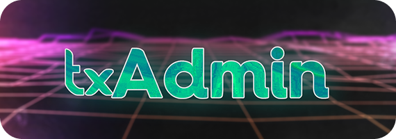

# vibeSM

    

        
    

    

        <strong>vibeSM</strong> is a premium, fully featured web management panel and in-game administration tool designed to monitor and manage FiveM and RedM servers. With custom enhancements like multi-hosting, community-driven themes, and streamlined settings, vibeSM makes hosting accessible and beautiful.
    

    

        
        
    

---

## Key Features

### Multi-Hosting Support
Run and manage multiple FiveM server instances from a single, unified vibeSM dashboard. Seamlessly switch between server consoles, track active resources, and coordinate restarts across your entire infrastructure.

### Custom Community Themes
Personalize your management dashboard! vibeSM integrates with vibesm.cc to fetch and apply community-made themes directly from the settings menu.

### In-Game Admin Menu
A comprehensive in-game menu for server administrators:
- **Player controls:** NoClip, God Mode, SuperJump, and spectator options.
- **Trolling & Moderation:** Warn, ban, kick, freeze, or set players on fire.
- **Vehicle Spawner:** Spawn, repair, customize, delete, or boost vehicles.
- **World Management:** Reset world areas, trigger announcements, and manage server states.

### Monitoring & Stability
- **Auto-Restarter:** Automatically boot your FiveM/RedM instance if it crashes or hangs.
- **Resource Analytics:** Real-time monitoring of CPU, memory, and thread performance.
- **Live Console:** Fast search, command history, and direct console interactions.
- **Activity Logging:** Comprehensive audit logs for player connections, chat messages, kills, and explosions.

### Access Control & Security
- **Authentication:** Connect using Discord, Cfx.re, or standard passwords.
- **Granular Permissions:** Assign specific read/write access levels to different staff members.
- **Player Database:** Built-in whitelist and warning system that operates independently without requiring an external database.

---

## Running vibeSM

vibeSM is designed to integrate cleanly with your FXServer configuration:

1. Launch FXServer **without** specifying a `+exec server.cfg` in the startup script to trigger the setup wizard.
2. vibeSM will automatically start and generate a setup URL in your terminal.
3. Open the URL in your browser to link your account, set up your server path, and start managing.

---

## License
This project is licensed under the [MIT License](LICENSE).
